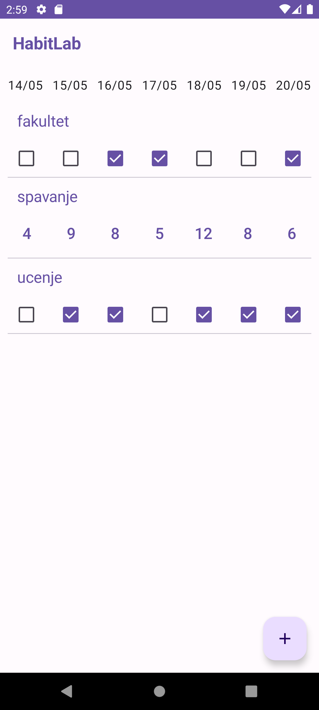
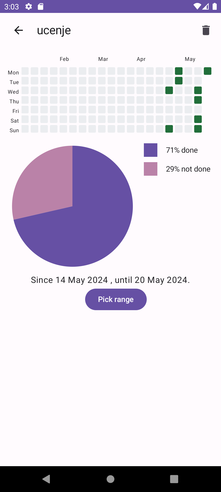
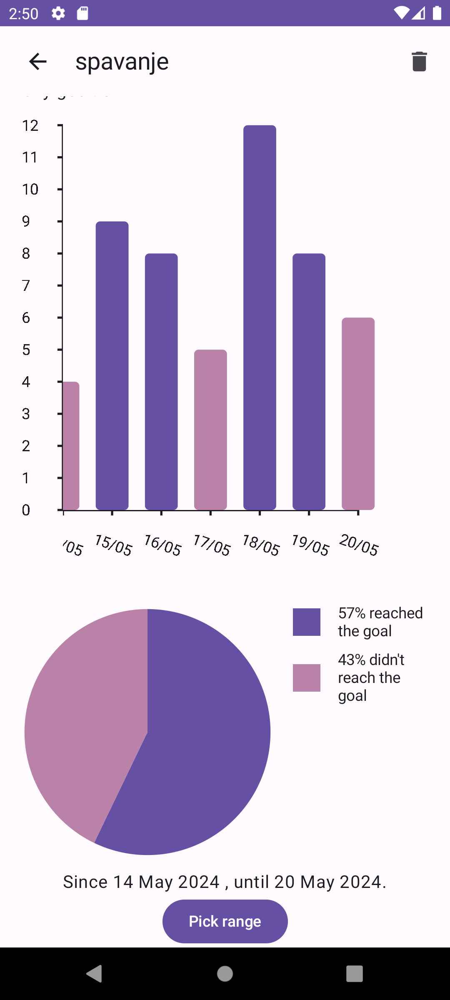
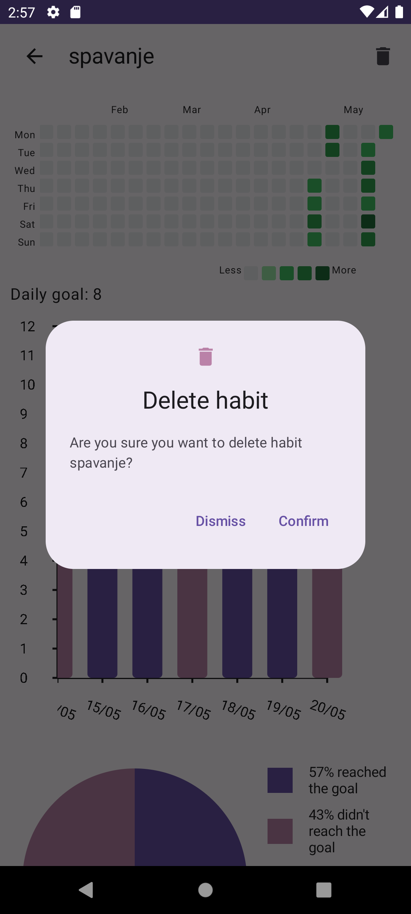

# HabitLab

Android aplikacija za praćenje navika,
rađena kao projekat na predmetu Programske paradigme.

Pored pregleda navika koje korisnik treba da izvrši
u toku dana, aplikacija pruža uvid u statistiku
izvršavanja navike u izabranom vremenskom periodu.

## Korišćene tehnologije
Aplikacija je pisana u programskom jeziku Kotlin,
u razvojnom okruženju Android Studio. Za razvoj
korisničkog interfejsa korišćen je Jetpack Compose.

## Instalacija
Za pokretanje aplikacije potrebno je imati telefon ili emulator sa operativnim sistemom Android (verzija 8.0+).
Emulator za Android postoji u okviru okruženja Android Studio.

Možete je instalirati korišćenjem instalacionog fajla iz Releases sekcije.
Potrebno je samo preuzeti i otvoriti fajl na telefonu, ili ga prevući do prozora sa emulatorom.
Alternativno, možete prevesti izvorni kod.

## Prevođenje
Najlakši način da prevedete kod je korišćenjem okruženja [Android Studio](https://developer.android.com/studio).
Povežite [svoj uredjaj](https://developer.android.com/studio/run/device)
ili napravite [Android Emulator](https://developer.android.com/studio/run/emulator)
i kliknite dugme "Run".

## Uputstvo za korišćenje
Kada otvorite aplikaciju, klikom na dugme "+" u donjem desnom uglu ekrana možete da dodate novu naviku.
Postoje dve vrste navika:
binarne navike kojima navodite samo ime i koje treba da obavljate jednom dnevno
i numeričke za koje treba da navedete cilj, koliko puta dnevno biste želeli to da radite.

Na glavnoj strani možete da menjate podatke o tome šta ste kada i koliko uradili.
Za binarne navike, to se radi označavanjem odgovarajućeg checkbox-a, dok se za numeričke navike to
radi tako što se dotakne broj za neki dan nakon čega se otvara dijalog u kom se on može promeniti.
Prikazani su podaci iz poslednjih 7 dana.

Klikom na naziv neke navike, otvara se ekran sa statistikama.
Tu se prikazuje kalendar na kom je označeno koliko je nešto rađeno kog dana.
Klikom na neki dan u kalendaru, otvara se dijalog u kom je moguće menjati podatak za taj dan.
Na pie chart-u je prikazano koliko često ste ispunjavali cilj u nekom vremenskom periodu.
Za numeričke navike je prikazan i bar chart.
Vremenski period prikazan na njima je poslednjih 7 dana, ali se može menjati klikom na dugme "Pick range".

Klikom na dugme u gornjem desnom uglu, moguće je obrisati naviku.

## Screenshots

 
 
 
 

## Autori
Iva Ninčić

Aleksa Malkov

Isidora Majkić
